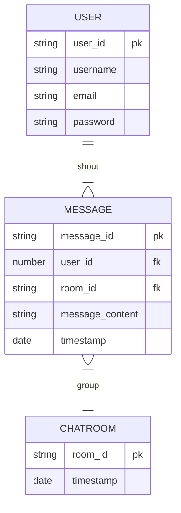

# Readme

## Database ER

## Midjourney Settings

- Assets
  - `/imagine icons, animals, cute, mockup, illustrator, vector, white background, --v 4 --style 4b`

- Background
  - `/imagine trees, forest, lush, dew, mobile wallpaper, mockup, illustrator, vector, figma, --v 4 --style 4b`

## Pocketbase

- user: admin@howlout.com
- pass: password123
- Notes
  - Maybe i dont want to do pocketbase and I should focus more on either sql, firebase, or mongo

##

